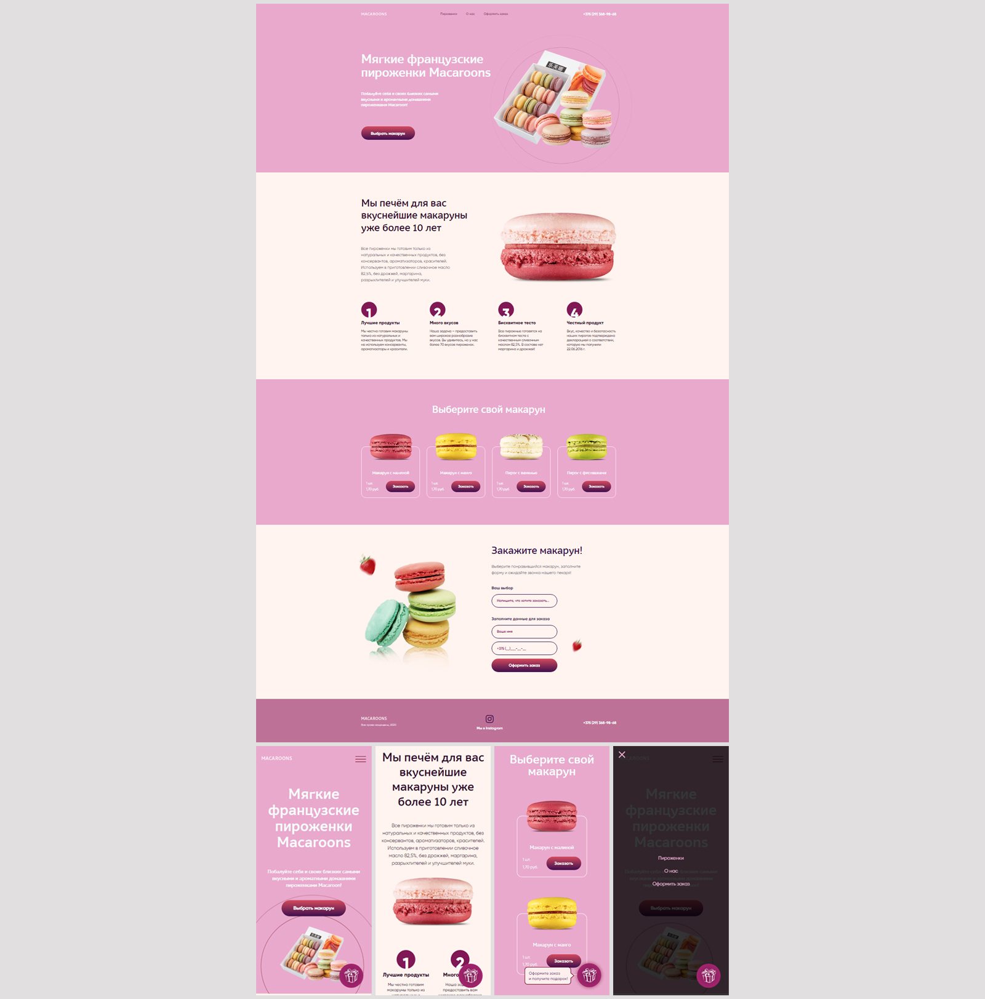

# Одностраничный сайт (лендинг) магазина французских пирожных

Самостоятельно выполненный проект в рамках обучения на курсе "Профессия Frontend-Разработчик" в онлайн-школе "Айтилогия".

## Внешний вид

## Выполненные задачи:
- Вёрстка адаптивной веб-страницы по макету;
- Практика адаптивной верстки (от 329px);
- Практика применения CSS-стилей, CSS-псевдоклассов, CSS Flexbox, CSS Grid Layout;
- Практика создания CSS-анимаций;
- Практика использования JavaScript для реализации функционала простейшей валидации, обработки событий, изменения структуры DOM-элементов.

## Используемые технологии:
* HTML
* CSS (Less)
* JavaScript
* jQuery
* Gulp / Grunt